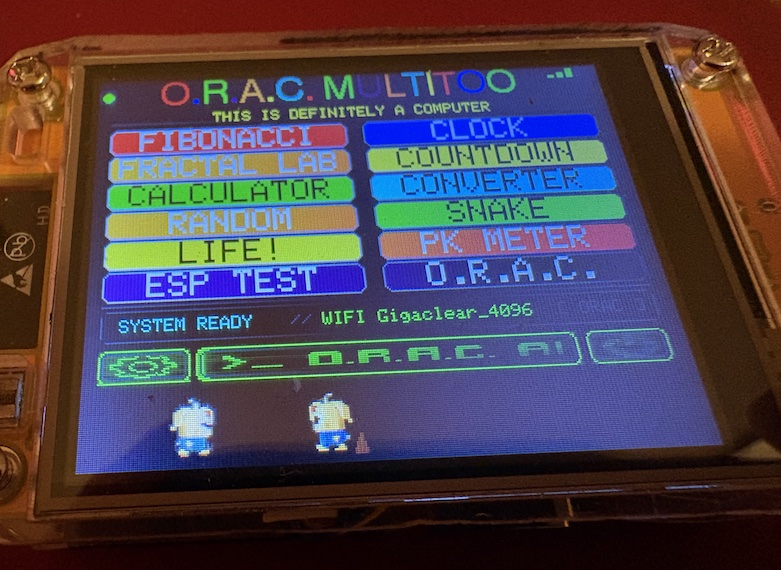

# O.R.A.C. Multitool

**O.R.A.C.** is a small, deliberately curious multitool built around the ESP32-2432S028 (CYD) touchscreen computer.

The project grew from the idea of making a device that feels less like a conventional utility gadget and more like a **small electronic companion**: useful tools, experiments, games, sound, visualisations and a little personality, all living together in one self-contained machine.

> **O.R.A.C. is an experiment in emergence — useful things, playful things and strange things sharing the same little computer.**

This repository contains a working development snapshot of the Arduino sketch. It is an evolving project rather than a polished library or framework.

## What is O.R.A.C.?

O.R.A.C. combines practical tools with deliberately playful experiments. The interface uses a terminal-green aesthetic and the project has gradually grown to include:

- A multi-tool launcher and settings system
- Clock/date functions using a DS3231 RTC
- Wi-Fi and internet-related tools
- An AI interface
- Conway's Game of Life
- Snake
- A virtual LIFE pet
- Thronglet walkers with independent movement and sound
- PK/radar-style experiments
- Sound generation and sound settings
- MicroSD storage
- Other small experiments and utilities

The project is intentionally allowed to evolve. Some parts are highly practical; others exist simply because they are interesting or fun.

## The philosophy

The aim isn't to reproduce a smartphone or build another generic ESP32 dashboard.

O.R.A.C. is meant to feel **alive, slightly mysterious and playful**, while remaining useful. The project mixes old-school electronics, modern AI, mathematical experiments, games and small visual/audio toys.

A recurring principle is that technology can be interesting for its own sake: patterns, sound, movement, randomness and interaction can all become part of the experience.

## Hardware

The current hardware is based on:

- **ESP32-2432S028 / CYD**
- 320×240 ILI9341 TFT display
- Resistive touchscreen
- DS3231 RTC
- MicroSD card
- On-board speaker/amplifier
- Battery/portable power arrangement

### Main connections

| Function | GPIO |
|---|---:|
| TFT MISO | 12 |
| TFT MOSI | 13 |
| TFT SCLK | 14 |
| TFT CS | 15 |
| TFT DC | 2 |
| TFT RST | -1 |
| Speaker / DAC2 | 26 |
| RTC SDA | 27 |
| RTC SCL | 22 |
| SD CS | 5 |
| SD SCK | 18 |
| SD MISO | 19 |
| SD MOSI | 23 |
| Touch CLK | 25 |
| Touch MOSI | 32 |
| Touch MISO | 39 |
| Touch CS | 33 |
| Touch IRQ | 36 |

## Software

The project is developed with:

- Arduino IDE 1.8.19
- ESP32 Arduino core
- TFT_eSPI
- Arduino networking/JSON components used by the sketch

The sketch is currently a large single `.ino` file. This is intentional for the moment: the priority has been getting the device working and experimenting rapidly before considering a larger architectural refactor.

## Current version

The public snapshot currently represents **v147.47**.

Recent work includes:

- Independent Thronglet footstep volume
- Synthetic Thronglet footsteps generated directly through the ESP32 DAC
- Two slightly different synthetic footstep sounds
- A small synthetic "poot" sound when a Thronglet performs its poo action
- Removal of the earlier RAW-footstep/calibration-test system

The project remains under active development and behaviour may change between snapshots.

## AI functions

Some O.R.A.C. functionality can use the OpenAI API.

The public source contains a **placeholder** rather than a real API key. Add your own key locally if you want to use those functions.

**Never commit a real API key, password, token or other secret to this repository.**

If a secret has ever been committed to a public repository, treat it as compromised and rotate/revoke it.

## Getting started

1. Install Arduino IDE and the appropriate ESP32 board support.
2. Install the libraries required by the sketch.
3. Select the appropriate ESP32/CYD board configuration.
4. Open the `.ino` file.
5. Add your own credentials where required, keeping secrets out of GitHub.
6. Connect the CYD and upload the sketch.

Because this is a development project, the exact library versions and configuration may change as the project develops.

## Project status

**Experimental / active development.**

Expect unfinished features, experiments, changing interfaces and occasional rough edges. The project is being developed incrementally on real hardware, with new ideas being tested as they arise.

## Licence

No open-source licence is currently attached to this repository. The source is publicly visible, but that does not by itself grant permission to copy, modify, redistribute or commercially use it.

A licence may be added in the future.

## Why O.R.A.C.?

The name and personality of the project are part of the experiment. O.R.A.C. isn't intended to be just a collection of functions — the goal is for the device to gradually acquire its own character through the things it does, the sounds it makes and the small surprises built into it.

---

*O.R.A.C. — a little machine for useful things, curious things and things that don't necessarily need a reason.*
